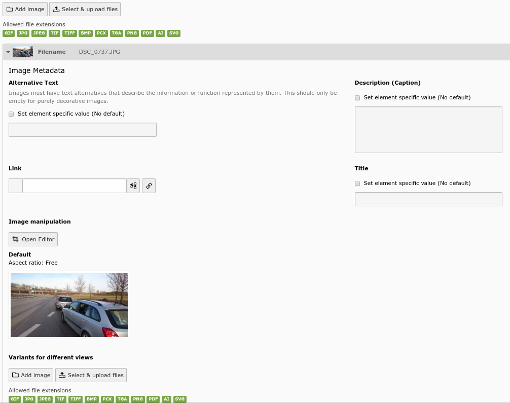
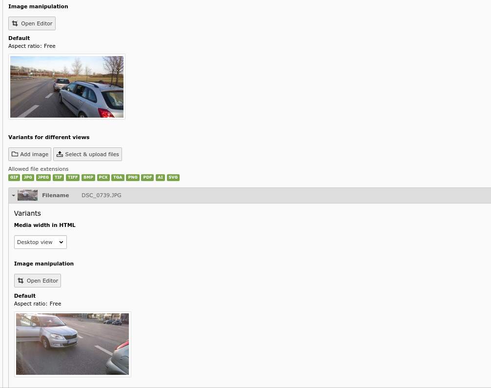

.. ==================================================
.. FOR YOUR INFORMATION
.. --------------------------------------------------
.. -*- coding: utf-8 -*- with BOM.

.. include:: ../Includes.txt

.. _introduction:

Introduction
------------

.. _what-does-it-do:

What does it do?
^^^^^^^^^^^^^^^^

This is a TYPO3 Extension which automatically creates media alternatives for an image.

In the TYPO3 Backend an image can have alternative images and crop configurations per media query added.

For the Frontend a Fluid Partial is available as drop-in replacement for the Media/Rendering/Image Partial shipped with the fluid_styled_content extension in TYPO3 9 and 10.

An editor can select a part of an image for mobile display and a completely different image for the 4k Desktop.

New in 1.0.0
* missing media sizes are now created automatically
* media sizes and their maxWidth and maxHeight are now configured in TypoScript
* Partial Media/Rendering/Image is a true drop-in replacement
* Documentation covers usage in the Frontend

.. _screenshots:

Screenshots
^^^^^^^^^^^

   The standard view of the image backend with the new variants button

   The view with an added variant image
